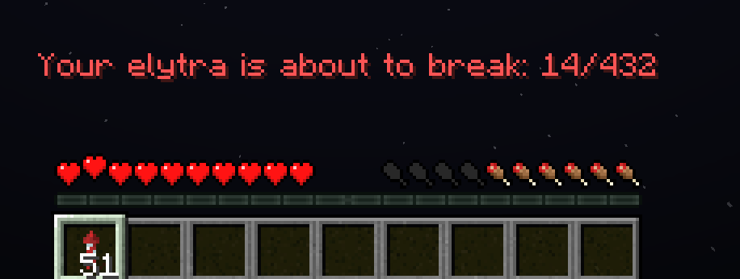

# elytra-warning

A simple datapack for Minecraft 1.21.5 for warning the player when their elytra is about to break.

This is solely achieved via `trigger` commands and therefore none of the players are required to have op-level privileges.



## How to use

1. Download the datapack and simply place it in your world's `datapack` folder
2. Reload all datapacks or directly enable the pack via 
``` mcfunction
/datapack enable "file/elytra-warning"
```
3. Enable and toggle the warning display via
``` mcfunction
/trigger elytra_warning
```
The threshold for displaying the warning is controlled by the `elytra_durability_threshold` scoreboard objective and is set to `32` by default.
You can modify this value temporarily via:
``` mcfunction
/scoreboard players set @a elytra_durability_threshold <value>
```
or permanently by going into `<DATAPACK-FOLDER>/elytra-warning/data/elytrawarning/function/load.mcfunction` and modifying the marked command.

If you want to remove all the scoreboard objectives used by the datapack, run
``` mcfunction
/function elytrawarning:remove
```
before disabling the pack.
